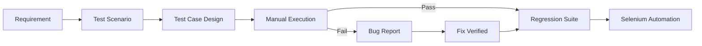

<div align="center">

# Mathubalan

### QA Engineer &nbsp;·&nbsp; Manual &amp; Automation Testing


<br/>

<a href="https://github.com/Jothirupan26"></a>
<a href="YOUR_LINKEDIN_URL"></a>
<a href="mailto:YOUR_EMAIL@example.com"></a>


</div>

<br/>

<table align="center" width="100%">
<tr><td>

### About

I'm a QA Engineer who pairs manual precision with automation efficiency — validating requirements by hand, then converting the highest-value checks into a stable Selenium/Java suite so regressions get caught before release, not after.

```yaml
role: QA Engineer
focus: Manual Testing, Selenium Automation
stack: Java · Selenium WebDriver · TestNG · Maven
principle: Think like a user. Test like a machine. Investigate like a developer.
exploring: Framework architecture, CI-integrated test suites
```

</td></tr>
</table>

<br/>

<div align="center">

### Core Skills

</div>

<table align="center" width="100%">
<tr>
<th align="left" width="50%">Manual Testing</th>
<th align="left" width="50%">Automation Testing</th>
</tr>
<tr>
<td valign="top">

- Functional &amp; regression testing
- Test case / scenario design
- UI &amp; exploratory testing
- Bug identification &amp; reporting
- Requirement analysis

</td>
<td valign="top">

- Selenium WebDriver (Java)
- TestNG — assertions, data providers, listeners
- Maven build &amp; dependency management
- XPath / CSS locator strategy
- Test reporting &amp; screenshot capture

</td>
</tr>
</table>

<div align="center">

<br/>


<br/>


</div>

<br/>

<div align="center">

### Featured Projects

</div>

<table align="center" width="100%">
<tr>
<td width="50%" valign="top">

**🏦 ParaBank Automation Suite**
<br/>
<sub>Selenium · Java · TestNG · Maven · Extent Reports</sub>

End-to-end coverage of core banking workflows — login, account management, fund transfer, bill payment — built on a modular Page Object Model.

```
src/
├─ main/java/
│  ├─ base/       driver setup
│  ├─ pages/      page objects
│  ├─ utils/      helpers
│  └─ listeners/  reporting hooks
└─ test/java/
   ├─ tests/
   └─ dataproviders/
```

[View Repository →](https://github.com/Mathubalan18/Bank_Project)

</td>
<td width="50%" valign="top">

**🌐 E-Commerce Web Automation**
<br/>
<sub>Selenium · Java · TestNG · Maven</sub>

Regression-ready suite covering the full shopping journey — login, registration, search, cart, checkout, and UI validation.

`Login` `Registration` `Search` `Cart`
`Checkout` `UI Validation` `Regression`

<br/>

[View Repository →](https://github.com/Mathubalan18/Selenium_Project)

</td>
</tr>
</table>

<br/>

<div align="center">

### Testing Workflow



</div>

<br/>

<div align="center">

### Current Focus

</div>

<table align="center" width="90%">
<tr><td width="30%">Manual Testing</td><td width="55%">████████████████████</td><td width="15%" align="right">95%</td></tr>
<tr><td>Selenium Automation</td><td>██████████████████░░</td><td align="right">90%</td></tr>
<tr><td>Java</td><td>█████████████████░░░</td><td align="right">80%</td></tr>
<tr><td>TestNG</td><td>█████████████████░░░</td><td align="right">80%</td></tr>
<tr><td>SQL</td><td>███████████████░░░░░</td><td align="right">70%</td></tr>
<tr><td>Framework Architecture</td><td>██████████████░░░░░░</td><td align="right">65%</td></tr>
</table>

<br/>

<div align="center">

### GitHub Stats

<table>
<tr>
<td></td>
<td></td>
</tr>
</table>


</div>

<br/>

<div align="center">

### Open To

**QA Engineer** &nbsp;·&nbsp; **Manual Tester** &nbsp;·&nbsp; **Automation Tester (SDET track)**

<br/>

`Selenium` `Java` `TestNG` `Maven` `SQL` `Manual Testing` `Test Automation`

</div>

<br/>

<div align="center">

> _"Don't just verify that it works — find out how it breaks."_

<br/>


</div>
